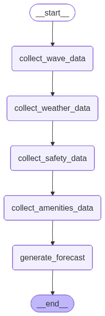

# 🏄 SurfSmart AI - Multi-Modal Surf Forecast Generator

**Foundations of Generative AI and LLMs - CA2**  
A Streamlit prototype with LangGraph multi-agent orchestration using Google Gemini 2.5 Flash

## 📋 Overview

SurfSmart AI demonstrates **multi-agent orchestration** using LangGraph to generate personalized surf forecasts. The system combines real-time API data, visual analysis of beach conditions, and AI reasoning to provide skill-specific surf recommendations with safety warnings.

### Key Features

- 🗺️ **Interactive Ireland Map** - Click beach markers to select surf spots
- 🤖 **LangGraph Multi-Agent System** - 5 specialized agents working in sequence
- 🌊 **Live API Integration** - Real wave, tide, and weather data
- 📸 **Multi-Modal AI** - Analyzes text + images with Gemini 2.5 Flash
- 🎯 **Personalized Forecasts** - Tailored to beginner/intermediate/advanced surfers
- ⚠️ **Safety-First Design** - Prioritizes riptide alerts and hazard warnings
- 🔍 **LangSmith Tracing** - Full observability of agent workflow
- 🎨 **Surf-Themed UI** - Light, clean interface with ocean aesthetics

---

## 🚀 Setup

### Prerequisites
- Python 3.10+
- Google Gemini API key ([Get yours here](https://makersuite.google.com/app/apikey))

### Installation

```powershell
# Clone the repository
git clone https://github.com/Dowline1/SurfSmart_AI.git
cd SurfSmart_AI

# Install dependencies
pip install -r requirements.txt

# Configure environment variables
# Copy .env.example to .env and add your API keys
copy .env.example .env
# Edit .env and add:
# - GEMINI_API_KEY (required)
# - STORMGLASS_API_KEY (optional - live wave data)
# - WORLDTIDES_API_KEY (optional - live tide data)
# - LANGCHAIN_API_KEY (optional - LangSmith tracing)

# Run the app
streamlit run app.py
```

The app will open at `http://localhost:8501`

---

## 🏗️ Architecture

### LangGraph Workflow Visualization



The diagram above shows the sequential execution of agents in the SurfSmartGraph StateGraph. Each node represents a specialized agent that collects and processes specific data types before passing state to the next agent.

### How It Works

1. **User Selection**
   - Clicks a beach marker on the Ireland map
   - Selects skill level (Beginner/Intermediate/Advanced)
   - Uploads image or uses sample webcam image

2. **LangGraph Agent Pipeline** (Sequential Execution)
   ```
   User Input → Wave Agent → Weather Agent → Safety Agent → Amenities Agent → Forecast Agent → Output
   ```

3. **Data Collection Phase**
   - **Wave Agent**: Calls Stormglass API (wave height/period/direction) + WorldTides API (tide status)
   - **Weather Agent**: Calls Open-Meteo API (wind speed/direction, temperature)
   - **Safety Agent**: Simulated riptide alerts and warnings
   - **Amenities Agent**: Simulated surf shop and parking data

4. **AI Forecast Generation**
   - Combines all collected data into structured prompt
   - Sends prompt + beach image to Gemini 2.5 Flash (multi-modal)
   - AI analyzes numerical metrics + visual conditions
   - Generates 3-sentence forecast with safety warnings

5. **Output Display**
   - Main forecast text (skill-specific advice)
   - Collected data from each agent (JSON format)
   - Safety warnings highlighted
   - Nearby amenities information

### Multi-Modal Fusion

The system demonstrates true multi-modal AI by combining:
- 📊 **Structured Data**: Wave height (meters), wind speed (knots), tide timing
- 🎯 **Contextual Data**: Safety alerts, local amenities, skill level
- 📸 **Visual Data**: Beach image analyzed for crowd levels, wave quality, surface conditions
- 🧠 **AI Reasoning**: Gemini synthesizes all inputs into coherent, safe recommendations

---

## 💻 Technical Stack

### Core Technologies
- **Streamlit 1.28+**: Web application framework
- **LangGraph 0.2+**: State-based agent orchestration (StateGraph)
- **LangChain 0.1+**: Agent framework foundation
- **Google Gemini 2.5 Flash**: Multi-modal LLM (text + image analysis)
- **Folium + Streamlit-Folium**: Interactive maps
- **PIL (Pillow) 10.0+**: Image processing
- **python-dotenv**: Environment variable management

### Live APIs
- **Stormglass API**: Real-time wave/swell data (requires API key)
- **WorldTides API**: Global tide predictions (requires API key)
- **Open-Meteo API**: Free weather data (no key required)

### Observability
- **LangSmith**: Agent workflow tracing, token usage, latency monitoring

### Project Structure

```
SurfSmart_AI/
├── .streamlit/
│   └── config.toml           # Light theme configuration
├── agents/
│   ├── __init__.py
│   ├── data_agents.py        # 5 specialized data agents
│   ├── forecast_graph.py     # LangGraph orchestrator
│   ├── webcam_fetcher.py     # Image loading utility
│   └── sample_images/        # Local beach images
│       ├── liscannor_bay.jpg
│       ├── lahinch.jpg
│       └── bundoran.jpg
├── app.py                    # Streamlit UI
├── requirements.txt          # Python dependencies
├── .env                      # API keys (NOT committed)
├── .env.example             # Template
├── .gitignore               # Git protection
└── README.md                # This file
```

### Agent Classes

**Data Collection Agents** (`agents/data_agents.py`):
- `WaveDataAgent`: Stormglass (waves) + WorldTides (tides) with fallback to simulated data
- `WeatherDataAgent`: Open-Meteo (wind/temp) with fallback
- `SafetyDataAgent`: Simulated riptide alerts (future: integrate real marine warnings)
- `AmenitiesDataAgent`: Simulated surf shops/parking (Google Places disabled for prototype)
- `WebcamAgent`: Placeholder (not currently used)

**Workflow Orchestrator** (`agents/forecast_graph.py`):
- `SurfSmartGraph`: LangGraph StateGraph managing sequential agent execution
- `ForecastState`: TypedDict tracking data flow through pipeline
- Multi-modal prompt builder combining all agent data + image

---

## 📊 Usage & Testing

### Basic Workflow

1. **Select Location**: Click a beach marker on the Ireland map (Liscannor Bay, Lahinch, or Bundoran)
2. **Choose Skill Level**: Select from sidebar (Beginner/Intermediate/Advanced)
3. **Provide Image**: 
   - Option A: Upload your own beach/wave image
   - Option B: Use live sample webcam image
4. **Generate Forecast**: Click the blue button and wait ~5 seconds
5. **Review Results**: Read forecast + view all collected agent data

### Test Scenarios

| Skill Level | Beach | Expected Behavior |
|-------------|-------|-------------------|
| **Beginner** | Liscannor Bay | Emphasizes safety, gentle conditions |
| **Intermediate** | Lahinch | Balanced technical + safety advice |
| **Advanced** | Bundoran | Detailed wave analysis, assumes experience |

### What the AI Analyzes

From **APIs**:
- Wave height (meters), period (seconds), direction
- Wind speed (knots), direction, temperature (°C)
- Tide status and timing
- Safety alerts

From **Image**:
- Crowd density (how busy the beach is)
- Wave quality (clean lines vs choppy)
- Visual hazards (rocks, currents)
- Surface conditions

### LangSmith Tracing

If enabled in `.env`, view detailed traces at [smith.langchain.com](https://smith.langchain.com):
- Agent execution timing
- API call success/failure
- Token usage per forecast
- Full prompt and response
- Error debugging

---

## 🎓 Educational Highlights (CA2)

This project demonstrates key concepts from **Foundations of Generative AI and LLMs**:

### 1. Multi-Agent Orchestration
- **LangGraph StateGraph**: Sequential agent pipeline with shared state
- **Specialized Agents**: Each agent has single responsibility (wave, weather, safety, amenities)
- **Error Handling**: Fallback to simulated data when APIs fail
- **State Management**: TypedDict tracks data flow through workflow

### 2. Multi-Modal AI
- **Text + Image Fusion**: Gemini analyzes both numerical data and visual beach conditions
- **Prompt Engineering**: Structured prompt combining 4 data sources into coherent instructions
- **Context Window Management**: Efficient prompt design within token limits

### 3. Real-World Integration
- **Live APIs**: Stormglass, WorldTides, Open-Meteo for actual surf data
- **Graceful Degradation**: System works with or without API keys
- **Safety-First Design**: AI trained to prioritize user safety in recommendations

### 4. AI Observability
- **LangSmith Tracing**: Full visibility into agent decisions and API calls
- **Debugging**: Track token usage, latency, and error patterns
- **Production-Ready**: Monitoring setup for real deployment

### 5. User Experience
- **Interactive UI**: Folium map with clickable beach markers
- **Real-Time Feedback**: Spinner during agent execution
- **Data Transparency**: Show all agent-collected data alongside forecast

## 🔒 Security & Best Practices

- ✅ API keys stored in `.env` file (never committed)
- ✅ `.gitignore` protects sensitive files
- ✅ Error handling prevents key exposure in logs
- ✅ HTTPS for all API calls
- ✅ Timeout protection on external requests

## 🚧 Future Enhancements

- [ ] Live webcam scraping from onitsurf.com
- [ ] Google Places API for real surf shop data
- [ ] NWS/Marine warnings API integration
- [ ] Historical forecast accuracy tracking
- [ ] User feedback loop for model improvement
- [ ] More Irish surf locations
- [ ] Tide chart visualization
- [ ] Wave forecast graphs

## 📝 Development Notes

**Git Repository**: [github.com/Dowline1/SurfSmart_AI](https://github.com/Dowline1/SurfSmart_AI)

**Key Commits**:
- Initial prototype with simulated data
- LangGraph multi-agent system integration
- Live API integration (Stormglass, WorldTides, Open-Meteo)
- Interactive Ireland map with location selection
- Surf-themed UI with light mode

**Technologies Chosen**:
- **LangGraph** over LangChain ReAct agents for better state management
- **Gemini 2.5 Flash** for speed and multi-modal capabilities
- **Streamlit** for rapid prototyping
- **Folium** for interactive maps

---

**Built for CA2 - Foundations of Generative AI and LLMs**  
*Demonstrating practical multi-agent orchestration with real-world APIs and multi-modal AI*